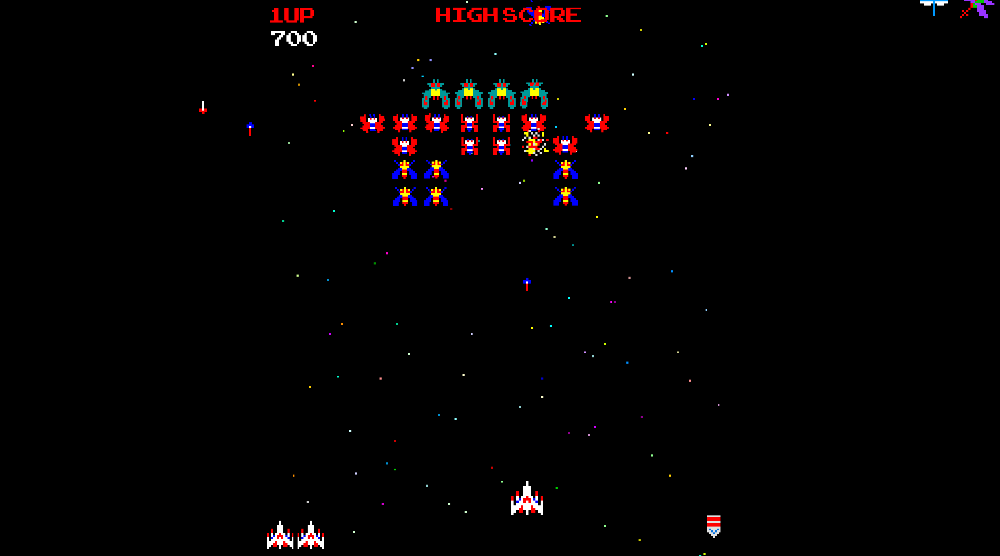

<h1>Maxalaga (Galaga clone)</h1>

Maxalaga is an 80's style shooter. Players pilot a space fighter and shoot at swarms of aliens who shoot back. As players takes out more of them, the enemies become faster and shoot back more frequently.

<h3>MVP</h3>
- [ ] A modal to outline controls, display number of lives and score.
- [ ] Players are able to move the fighter left, right, up and down using cursor keys.
- [ ] Players make the fighter shoot projectiles by pressing the space bar.
- [ ] Enemies appear in formation and shoot projectiles toward the player controlled fighter.
- [ ] When an enemy's projectile hits the player's ship the player loses a life.
- [ ] The game keeps score by counting the number of enemies the player is able to eliminate before losing all their lives.

<h1>Wireframes<h1>

The game mode will look something like this, but with a link to my portfolio site and github in the upper right corner.

</img>

<h1>Architecture and Technologies</h1>

* HTML Canvas with JavaScript DOM manipulation for rendering (will have to look into Easel.js).
* Vanilla javascript for game logic, keeping score, tracking collisions, etc.
* Webpack for bundling files.

<h1>Time Line</h1>

**Day 1:**

* Setup the file structure, node modules and webpack.
* Reacquaint myself with HTML canvas and read the Easel.js docs
* Implement the canvas and implement the logic for moving objects/projectiles.

**Day 2:**

* Implement an object representing the spaceship that users can move using arrow keys.
* Create the movement logic for enemy spaceships.
* Give player and enemies the ability to fire projectiles that will inherit from the moving object/projectile class.

**Day 3:**

* Track collisions between projectiles and enemy/player ships.
* Implement the game logic, including keeping track of score and lives.
* Generate enemies in waves and formations. Generate a new wave when the player has eliminated the current wave.

**Day 4-5:***

* Create the title and instructional modal.
* Display score and number of lives remaining.
* Create images and animations.
